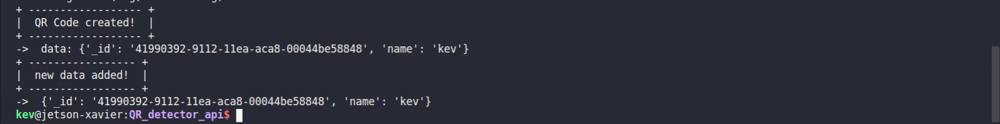
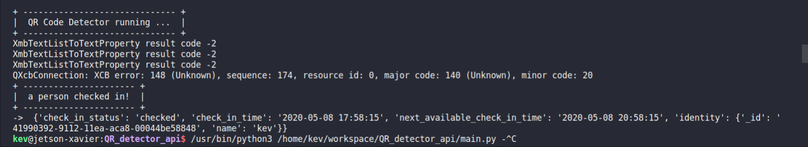
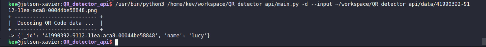

# QR_detector_api

This QR_detector_api demonstrates how to read/write identification data(JSON form) in a local database with a real-time detector. It can be used as a **real-ime employee check-in system**. Moreover, other IoT modules can be easily integrated with this api module.

The identification data JSON string will be encoded in a form of QR_Code and store in the local database.

* Each identification data object has two attributes: the **_id** and the **name** associated with that _id

* The Detector API runs at ~40 FPS on Jetson Xavier.
* All demos work on any Nvidia Jetson Devices such as TX2, Nano, and Xavier
* Furthermore, all demos should work on x86_64 PC or Mac as well.
* The embbed **Database Module** allows the user to retrieve any important data created by the detector.

*** The **Web Module** and the **Cloud Database Module** will be coming up soon ...

*** Check out my blog post for implementation details: [Link](https://www.hikariai.net)

*** Contact: yqlbu@bu.edu | kevinyu211@yahoo.com

Table of Contents
-----------------

* [Prerequisite](#prerequisite)
* [Demo #1: Detector](#demo-1-detector)
* [Demo #2: Database](#demo-2-database)
* [Setup](#setup)
* [How to Use](#how-to-use)


Prerequisite
------------

This QR_Detector_api was tested on both Jetson Nano and Jetson AGX Xavier DevKits. In order to run the demo below, you need to make sure you have the proper python packages installed on the target Jetson system, or local machine such as a x86 PC or Mac.

Please also make sure you have Python>=3.6 installed in your device.

To install the Python3 packages, simply run the command below in your terminal:

```bash
$ pip3 install -r requirement.txt
```

Furthermore, the app requires 'cv2'(OpenCV) module in Python3. If you are using a **Jetson Device**, the OpenCV module is pre-installed with the Jetpack, you do not need to install it again. For x86 PC or Mac user, please properly install the OpenCV module before you run the app.

<a name="prerequisite"></a>

Demo #1: Detector
-----------------

*** This demo illustrates how to run the QR_Code Detector in real-time.

* Authorized identity will be recognized with a green bounding box and an authorized text string on top of it.
* Unauthorized identity will be recognized with a red bounding box and an unauthorized text string on top of it.
* In the console, you may check the detailed information of that person when he or she checked in. Information includes the the **current_check_in_time**, **next_availabe_check_in_time**, the **_id** of that person, and the **name** of the person.

*** Notes: the user may customize the time-interval gap between **current_check_in_time** and the **next_availabe_check_in_time** (Default gap is set to 3 hours). Please check [HERE](#Setup) for instructions.

**QR_Code Detector Running in Real-time**


**Displaying the check-in information**


*** Check out the detailed description of how to run the operator [HERE](#How-to-Use).

*** Check out the flag table [HERE](#Detector-Flag-Table).

<a name="Demo #1: Detector"></a>

Demo #2: Database
-----------------

*** This demo illustrates how to execute multiple operations in the databases.

* Create a new user
* Switch User
* Fetch user data from config
* Fetch data from a specified db
* Remove data
* Updata data

**Create a new user**
**Switch User**
**Fetch user data from config**s
**Fetch data from a specified database**
**Remove data**
**Updata data**

*** Check out the detailed description for each operator [HERE](#Operators:).
*** Check out the flag table [HERE](#Database-Flag-Table).


<a name="Demo #1: Detector"></a>

Setup
-----

**[Step-by-step]**

**Step #1**: Clone this repository

```bash
$ cd ~
$ git clone https://github.com/yqlbu/QR_detector_api
$ cd QR_detector_api
```

**Step #2**: Check Repository Tree

```bash
$ sudo apt-get install -y tree
$ tree
```
*** Your working directory should be as shown below:
```bash
.
├── db
│   └── README.md
├── db.py
├── demo_screenshots
├── init.py
├── main.py
├── README.md
├── requirement.txt
└── utils
    ├── authentication.py
    ├── db_argparser.py
    ├── db_utils.py
    ├── __init__.py
    ├── opencv.py
    ├── qr_argparser.py
    ├── qr_code.py
    └── timer.py
```
<a name="Setup"></a>

How to Use
----------

**Step #0**: Initiate an admin account and instantiate databases

```bash
$ python3 init.py
```
*** You will notice that, your working directory has added two folders: **/data** and **/config**

*** The program will create an admin account for the first-time you run the app, and the program will generate an **access_token** as well. You will need to save this access token for future use.

*** Paste the access_token inside the main.py, as shown below:

```python
# Token is for authorizing your identity
ACCESS_TOKEN="TOKEN"
```

**Step #1**: Add data

*** "-n" flag is for creating a new QR_Code data object, you need to speciy the name of the data in the console

eg: $ python3 main.py -n kevin

```bash
$ python3 main.py -n name
```
*** The QR_Code will be saved in PNG format, and can be found in **./data**



**Step #2**: Run the detector api by running the command below

```bash
$ python3 main.py -r
```

*** Open up the saved QR_Code.png in ./data, the detector should be able to detect the QR_code and decode its content.

*** In the console, you may also find the check-in information of that person



**Decode an input QR_Code**

*** Copy the desired QR_Code, and then pass the input with the command flags as shown below:

```bash
$ python3 main.py -d --input path
```

```bash
#for instance
$ python3 main.py -d --input ~/workspace/QR_detector_api/data/41990392-9112-11ea-aca8-00044be58848.png
```



<a name="How to Use"></a>

Database Module
---------------

An embeded light database module (Tinydb) is installed with the app. 

* The app will instantiate two databases: **db**(for storing identity) and **check_in_db**(for storing check-in record)

* User may retrieve data from the databases by passing specific operation commands. There are multiple operations you may play around with the database module. You are required to go through the **authentication process** before running the operators.
* User instances are limited to certain operators, whereas an **admin user** (created in first-time usage) grants rights to all operators.
* For the usage of each operator, please check out the operation examples below:

### Operators:

* [Create a new user](#Create-a-new-user)
* [Switch User](#Switch-User)
* [Get data of registered user](#Get-data-of-registered-user)
* [Read data](Read-data)
* [Remove data](Remove-data)
* [Updata data](Update-data)

#### Create a new user

*** This operator will create a user instance with the rights to read, delete, and update objects in the databases. 

*** Only the admin user has the right to create a new user.

```bash
$ python3 db.py --init
```

#### Switch User

*** To switch to another user, you need to modify the access_token associated with that user in db.py

```python
# Token is for authorizing your identity
ACCESS_TOKEN="TOKEN"
```

#### Get data of registered user

*** This operator will retrieve a list of registered user data.

*** Only the admin user has the right to create a new user.

Retrieve data for all registered users:
```bash
$ python3 db.py --get_users --all
```

Retrieve data for a particular registered user:
```bash
$ python3 db.py --get_users --name name
```

#### Read data

*** This operator will fetch data from a database
*** If the name of the database is not specified, then the operator will fetch data from the default db (For storing identity data)
* The flag **--name** needs to be passed with the command to specify the name of the database.

Fetch data from the default db(for storing identity)
```bash
$ python3 db.py -d
```

*** If the flag **--name check_in_db** is passed, the operator will fectch data from the check_in_db (for storing check-in record)

Fetch data from the check_in_db(for storing check-in record)
```bash
$ python3 db.py -d --name check_in_db
```

#### Remove data

*** This operator will remove data from a db.
* The flag **--name** needs to be passed with the command to specify the name of the database.
* The flag **--all** needs to be passed with the command to remove all data from the db.
* The flag **--id** needs to be passed with the command to specify which data to be deleted. You may need to retrieve identity data to get the id.
    ```bash
    $ python3 db.py -d --all
    ```

Remove all data from db(for storing identity)
```bash
$ python3 db.py -r --name db --all
```
Remove all data from check_in_db(for storing check-in record)
```bash
$ python3 db.py -r --name check_in_db --all
```
Remove data with id from db(for storing identity)
```bash
$ python3 db.py -r --id id
```

#### Updata data

*** This operator will update data with a specified id from the db(for storing identity data)
* The flag **--name** needs to be passed with the command to specify the name of the database.
* The flag **--id** needs to be passed with the command to specify which data to be deleted. You may need to retrieve identity data to get the id.
    ```bash
    $ python3 db.py -d --all
    ```

```bash
$ python3 db.py -u --id id --name new_name
```

Basic Usage
-----------

#### Detector Flag Table

|Operation        |Flags      |Description                  |
|:----------------|:----------|:----------------------------|
|help             |-h         |help menu                    |
|decode           |-d         |decode a QR_Code             |
|create a QR_Code |-n         |create a QR_Code with name   |
|run              |-r         |run the detector             |
|input file       |--input    |pass an input file           |

#### Database Flag Table

|Operation                           |Flags                |Description                                                                                |
|:-----------------------------------|:--------------------|:------------------------------------------------------------------------------------------|
|create a new user                   |--init               |create a user instance with the rights to read, delete, and update objects in the databases|
|get data of registered user         |--get_users          |retrieve a list of registered user data                                                    |
|all                                 |--all                |flag all data                                                                              |
|name                                |--name               |specify name                                                                               |
|id                                  |--id                 |specify id                                                                                 |
|help                                |-h                   |help menu                                                                                  |
|read data                           |-d                   |fetch data from a database                                                                 |
|remove data                         |-r                   |remove data from a db                                                                      |
|updata data                         |-u                   |update data with a specified id from the db(for storing identity data)                     |


<a name="Basic Usage"></a>

Web Module
----------

Coming soon ...

<a name="Web Module"></a>
